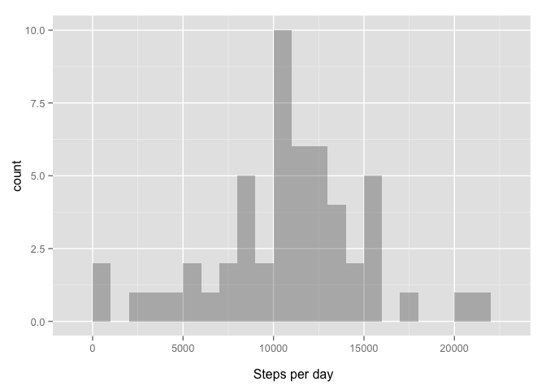
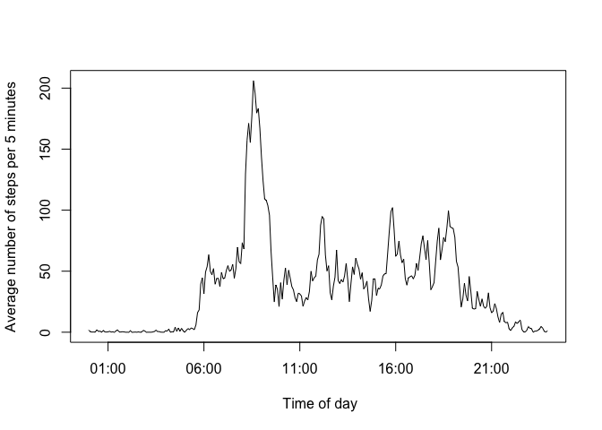
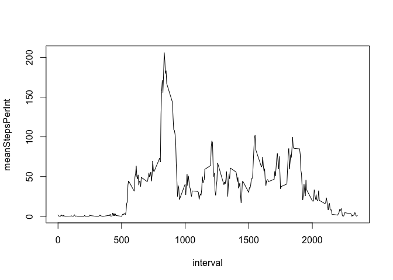
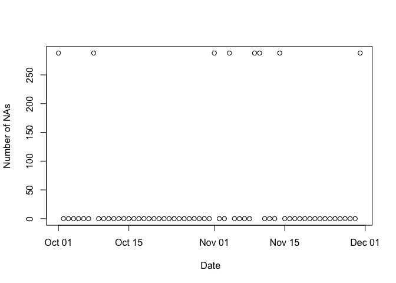
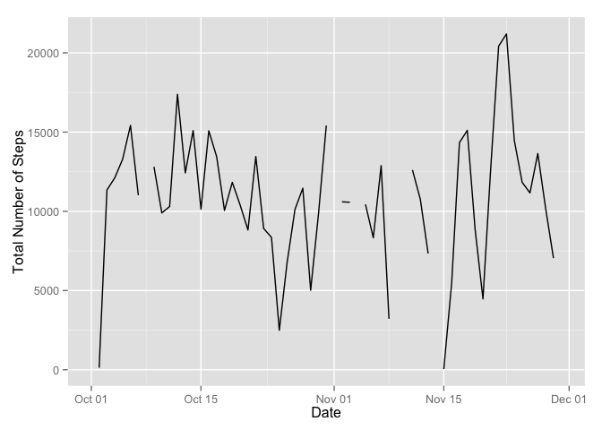
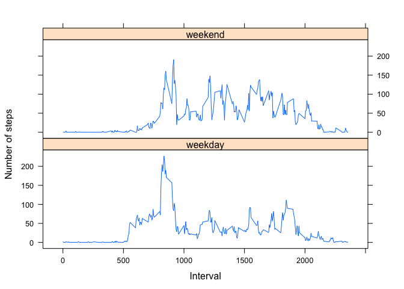

# Reproducible Research: Peer Assessment 1

## Loading and preprocessing the data


Let's assume the zip file is already downloaded to working directory. After unzipping the raw <span class="code">.csv</span> data can be read with the fast <span class="code">fread(input, ...)</span> function  from the <span class="code">data.table</span> package. The raw format of the 'date' column coincides with the default format of <span  class="code">as.Date(x, ...)</span> function: "%Y-%m-%d". 

```r
    require(data.table)
```

```
## Loading required package: data.table
```

```r
    unzip("activity.zip")
    ActivityData <- fread("activity.csv", sep=",", header = TRUE)
    ActivityData$date <- as.Date(ActivityData$date)
    #str(ActivityData)
```


## What is mean total number of steps taken per day?
Let's make plots with a comprehensive <span class="code">ggplot2</span> package. 

```r
    require(ggplot2)
```

```
## Loading required package: ggplot2
```

To calculate the **total number of steps per day** let's use the data.table <span class="code">DT[i, j, by]</span> syntax:

```r
    stepsPerDay <- ActivityData[, sum(steps), by = date]
    colnames(stepsPerDay)[2] <- "StepsPerDay"
    qplot(stepsPerDay[, StepsPerDay], binwidth=1000, alpha=I(0.3)) + 
        xlab("\n Steps per day")
```

 

Here is the <span class="code">summary()</span> function report with **median** and **mean** included:

```r
    options(digits = 10)
    summary(stepsPerDay[, StepsPerDay])
```

```
##     Min.  1st Qu.   Median     Mean  3rd Qu.     Max.     NA's 
##    41.00  8841.00 10765.00 10766.19 13294.00 21194.00        8
```

According to the distribution, the mean number of steps taken per day is:

```
## [1] 10766.18868
```

Assuming the step length of ~70 cm this corresponds to the average distance  covered per day (in [km]):

```
## [1] 7.536332075
```
That is pretty good! Also the famous recommendation about walking 10000 steps per day is fulfilled!  
   
## What is the average daily activity pattern?
Again, let's use the the data.table <span class="code">DT[i, j, by]</span> syntax with the 'interval' column as factor. To present the results in more readable fashion, let's plot the **average daily activity pattern** versus the **time of the day**, converting the 'interval' to time of <span class="code">POSIXlt</span> class:

```r
    meanActivityPattern <- ActivityData[, mean(steps, na.rm = TRUE), by = interval]
    colnames(meanActivityPattern)[2] <- "meanStepsPerInt"
    intervalTime <- strptime(paste(ActivityData$interval/100+0.001), format='%H.%M')
```
The plot with the raw 'interval' x-axis, explicitly requested in this Course Project, will be shown below as well.
To attach the  <span class="code">POSIXlt</span> class column with less work and nicer (for this use-case) syntax the <span class="code">data.table</span> object was converted to the <span class="code">data.frame</span> object.

```r
    intervalTime <- intervalTime[1:length(meanActivityPattern[, meanStepsPerInt])]
    meanActivityPattern <- as.data.frame(meanActivityPattern)
    meanActivityPattern$intTime <- intervalTime
```

Finally, let's plot the **average daily activity pattern** with the **time of day** as x-axis:


```r
    plot(intervalTime, meanActivityPattern[, "meanStepsPerInt"], type="l",
         xlab = "\n Time of day", 
         ylab = "Average number of steps per 5 minutes")
```

 

The maximum activity time slot:

```r
    strftime(meanActivityPattern[which.max(meanActivityPattern[, 2]), "intTime"], format="%H:%M")
```

```
## [1] "08:35"
```

That is **8:35** in the morning.   
   
The 'meanStepsPerInt' versus the 'interval' plot requested in this Course Project is shown below:

```r
    plot(meanStepsPerInt ~ interval, data=meanActivityPattern, type="l")
```

 

   
## Imputing missing values

The number of missing values for each column is reported by <span class="code">summary()</span>:

```r
    summary(ActivityData)
```

```
##      steps               date               interval      
##  Min.   :  0.0000   Min.   :2012-10-01   Min.   :   0.00  
##  1st Qu.:  0.0000   1st Qu.:2012-10-16   1st Qu.: 588.75  
##  Median :  0.0000   Median :2012-10-31   Median :1177.50  
##  Mean   : 37.3826   Mean   :2012-10-31   Mean   :1177.50  
##  3rd Qu.: 12.0000   3rd Qu.:2012-11-15   3rd Qu.:1766.25  
##  Max.   :806.0000   Max.   :2012-11-30   Max.   :2355.00  
##  NA's   :2304
```

The <span class="code">NA</span>s are present only in 'steps' column. Moreover they are strictly grouped by date, i.e. data is totally missing for certain days, while the data for other days is complete. This can be seen from the plot below, where the number of <span class="code">NA</span>s per day is plotted versus the date:


```r
    naPerDay <- ActivityData[,sum(is.na(steps)), by=date]; 
    colnames(naPerDay)[2] <- "NumOfNA"
    plot(naPerDay, xlab = "\n Date", ylab = "Number of NAs")
```

 

The missing days are:

```r
    missingDays <- naPerDay[naPerDay$NumOfNA>1, date]
    missingDays
```

```
## [1] "2012-10-01" "2012-10-08" "2012-11-01" "2012-11-04" "2012-11-09"
## [6] "2012-11-10" "2012-11-14" "2012-11-30"
```

For this data imputing 'steps' values for missing days is pretty speculative. Interpolating the **daily activity pattern** from the closest days with data can be somewhat useful. There is no clear pattern in the **number of steps per day** plotted versus **date**:

```r
    qplot(date, V1, data = ActivityData[, sum(steps), by = date], geom = "line", 
          xlab = "Date", 
          ylab = "Total Number of Steps" )
```

```
## Warning: Removed 2 rows containing missing values (geom_path).
```

 

However, let's interpolate the **daily activity pattern** for missing dates from the closest days with data. If the missing day is at the borders of the dataset (i.e. only one neighbor exist) the daily activity will be filled with the activity pattern averaged over all days.

```r
    ActivityDataFilled <- copy(ActivityData)
    #indices of days with missing data
    missindex <- which(naPerDay$NumOfNA>1)
    for( i in 1:length(missindex)){
        dateTofill <- missingDays[i]
        if(missindex[i]==1 | missindex[i]==length(naPerDay$date)){ 
            # filling with global average daily activity
            ActivityDataFilled[{date %in% dateTofill}]$steps<-as.integer(meanActivityPattern$meanStepsPerInt)
        } else {
            # serching to the closest left and right neighbour day with complete data (i.e not in missindex)
            indL <- missindex[i]-1; while(indL %in% missindex){indL<- indL-1};
            indR <- missindex[i]+1; while(indR %in% missindex){indR<- indR+1};
            # interpolating from neighbouring dates
            neighbourDates <- c(naPerDay$date[indL], naPerDay$date[indR])
            meanLocalPattern <- ActivityDataFilled[{date %in% neighbourDates}, mean(steps), by=interval]
            colnames(meanLocalPattern)[2] <- "meanStepsPerInt"
            ActivityDataFilled[{date %in% dateTofill}]$steps<-as.integer(meanLocalPattern$meanStepsPerInt)
        }    
    }
    
    stepsPerDayFilled <- ActivityDataFilled[, sum(steps), by = date]
    colnames(stepsPerDayFilled)[2] <- "StepsPerDay"
    qplot(stepsPerDayFilled[, StepsPerDay], binwidth=1000, alpha=I(0.3)) + 
        xlab("\n Steps per day")
```

 

Lets check if the values of the **mean** and **median** for the distribution of the **number of steps per day** have changed after imputing the missing days.
The new **median** and **mean** from <span class="code">summary()</span> report:

```
##     Min.  1st Qu.   Median     Mean  3rd Qu.     Max. 
##    41.00  8821.00 10641.00 10600.93 12883.00 21194.00
```
Compared to old **median** and **mean**:

```
##     Min.  1st Qu.   Median     Mean  3rd Qu.     Max.     NA's 
##    41.00  8841.00 10765.00 10766.19 13294.00 21194.00        8
```

the values have slightly changed.

## Are there differences in activity patterns between weekdays and weekends?

To answer this question the **average daily activity pattern** should be calculated separately for 'weekday' and 'weekend'. The factor column with levels 'weekday' and 'weekend' can be created as following:  

```r
    # creating a vector of weekends and weekdays by checking if the 'date' is Saturday or Sunday
    ifweekend <- ifelse( test = weekdays(ActivityDataFilled$date) %in% c("Saturday", "Sunday"), 
                         yes = c("weekend"), 
                         no = c("weekday"))
    # adding a factor column to data.table
    ActivityDataFilled[, ifWeekend:=as.factor(ifweekend)]
```

Then, using the hierarchical grouping with <span class="code">by = list()</span>,  the **mean activity patterns** for two factor levels can be calculated:  

```r
    # calculating the average daily activity pattern separately for weekend and weekday
    meanPatterns <- ActivityDataFilled[, mean(steps), by = list(interval, ifWeekend)]
    colnames(meanPatterns)[3] <- "NumberOfSteps"
```

According to the plot example in the README file the <span class="code">lattice</span> package was used. Let's use it as well:

```r
    require(lattice)
```

```
## Loading required package: lattice
```

```r
    xyplot(NumberOfSteps~interval | ifWeekend, data = meanPatterns, layout=c(1,2), type="l", 
           xlab = "Interval",
           ylab = "Number of steps")
```

 

There are certainly some differences in **daily activity patterns** for weekend and weekdays. Both patterns peak at morning. However, the 'weekend' activity pattern is slightly more uniform, while for the 'weekday' pattern the morning activity peak is more pronounced. 
   
